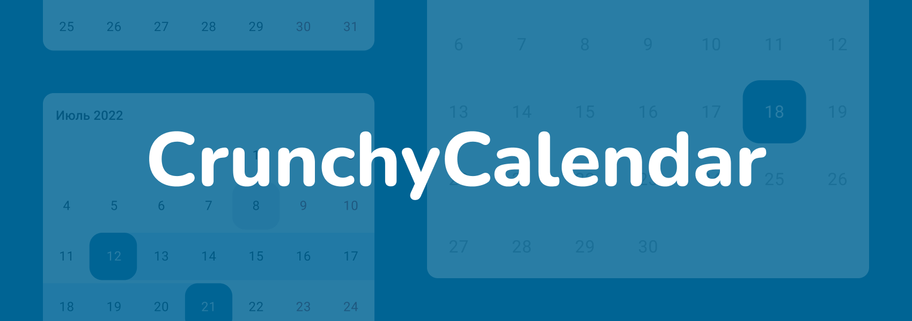
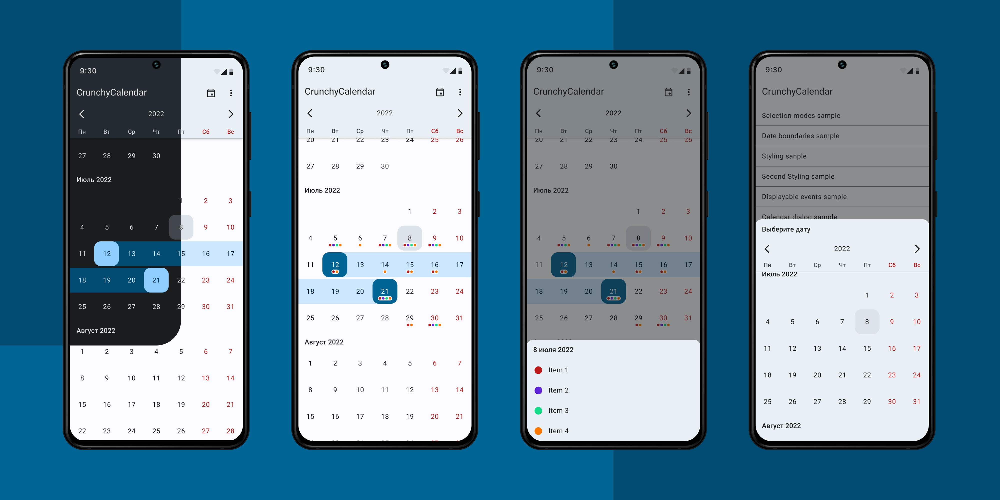

# CrunchyCalendar

A **light**, **powerful** and **easy to use** Calendar Widget with a number out of the box features:
* Infinite vertical scrolling in both directions;
* Setting date boundaries to restrict scrolling inside of a specific time period;
* Single / multiple / range dates selection;
* Pre-selecting dates;
* Color customization;
* Displaying color indicators;
* Setting own custom ItemDecoration;
* Presented as a View subclass which can be displayed everywhere: in Activity, Fragment or Dialog, 
or can be integrated into another custom View.



## Dependency

This library is available on [jCenter](https://bintray.com/cleverpumpkin/maven/CrunchyCalendar). jCenter is the default Maven repository used by Android Studio.

#### Gradle

```
implementation 'ru.cleverpumpkin:crunchycalendar:1.1.0'
```

#### Maven

```xml
<dependency>
  <groupId>ru.cleverpumpkin</groupId>
  <artifactId>crunchycalendar</artifactId>
  <version>1.1.0</version>
  <type>pom</type>
</dependency>
```

## Usage

Here's a basic example of Calendar usage.
 
First of all, you should declare `CalendarView` in your layout XML file.

```xml
  <ru.cleverpumpkin.calendar.CalendarView 
        android:id="@+id/calendar_view"
        android:layout_width="match_parent"
        android:layout_height="match_parent" />
```

Perform Calendar setup in your `Activity` or `Fragment` class.

```kotlin

val calendarView = view.findViewById(R.id.calendar_view)
val calendar = Calendar.getInstance()

// Initial date
calendar.set(2018, Calendar.JUNE, 1)
val initialDate = CalendarDate(calendar.time)

// Minimum available date
calendar.set(2018, Calendar.MAY, 15)
val minDate = CalendarDate(calendar.time)

// Maximum available date
calendar.set(2018, Calendar.JULY, 15)
val maxDate = CalendarDate(calendar.time)

// List of preselected dates that will be initially selected
val preselectedDates: List<CalendarDate> = getPreselectedDates()

// The first day of week
val firstDayOfWeek = java.util.Calendar.MONDAY

// Set up calendar with all available parameters
calendarView.setupCalendar(
    initialDate = initialDate, 
    minDate = minDate,
    maxDate = maxDate,
    selectionMode = SelectionMode.NON,
    selectedDates = preselectedDates,
    firstDayOfWeek = firstDayOfWeek,
    showYearSelectionView = true
)
                
```

**Note:** all parameters in `setupCalendar()` method are optional and have default values. 

To handle date click / long click with custom action, you can do this:

```kotlin

// Set date click callback 
calendarView.onDateClickListener = { date ->

    // Do something ... 
    // for example get list of selected dates
    val selectedDates = calendarView.selectedDates 
}

// Set date long click callback 
calendarView.onDateLongClickListener = { date ->

    // Do something ... 
}

```


## Saving and Restoring state  
Calendar takes care of saving and restoring its internal state (selected dates, selection mode, etc.),
so there's no need to save it manually and call setupCalendar() method every time, 
when `Activity` or `Fragment` is recreated.

If a Calendar was set up with `setupCalendar()` method **before** restoring state, previous saved 
state will be ignored. 

## Dates Selection
Calendar supports several selection modes: **single**, **multiple** and **range**.

**Note:** You can restrict selection of some dates by implementing your own filtration logic:

```kotlin

// Here we make weekends unavailable for selection
calendarView.dateSelectionFilter = { date ->
    date.dayOfWeek != Calendar.SATURDAY && date.dayOfWeek != Calendar.SUNDAY
}
```

#### Single date selection 
Only one date can be selected at a time.

```kotlin

// Set up calendar with SelectionMode.SINGLE
calendarView.setupCalendar(selectionMode = SelectionMode.SINGLE)

...

// Get selected date or null
val selectedDate: CalendarDate? = calendarView.selectedDate

// Get list with single selected date or empty list
val selectedDates: List<CalendarDate> = calendarView.selectedDates
```

#### Multiple dates selection 
A number of dates can be selected. Pressing an already selected date will unselect it.

```kotlin

// Set up calendar with SelectionMode.MULTIPLE
calendarView.setupCalendar(selectionMode = SelectionMode.MULTIPLE)

...

// Get all selected dates in order they were added or empty list
val selectedDates: List<CalendarDate> = calendarView.selectedDates

```

#### Range date selection 
Allows you to select a date range. Previous selected range is cleared when you select another one.

```kotlin

// Set up calendar with SelectionMode.RANGE
calendarView.setupCalendar(selectionMode = SelectionMode.RANGE)

... 

// Get all selected dates in range (includes start and end date) or empty list
val selectedDates: List<CalendarDate> = calendarView.selectedDates

```

## Color Indicators
The Calendar is able to display simple color indicators (dots) on the date cell.

Color indicator represents as simple interface, which you can implement in your classes.  

```kotlin

interface DateIndicator {
    val date: CalendarDate // indicator date
    val color: Int // indicator color
}

```

Here's an example of setting indicators to display on the Calendar.
 
```kotlin

// Set up calendar
calendarView.setupCalendar()


val indicators: List<DateIndicator> = getDatesIndicators()

// Set List of indicators that will be displayed on the calendar 
calendarView.datesIndicators = indicators


````

To get all indicators for specific date, you can do this:

```kotlin

// Set date click callback 
calendarView.onDateClickListener = { date ->

    // Get all indicators for the date
    val indicatorsForDate = calendarView.getDateIndicators(date)
    
    // do something ... 
}

```

## View Customization

Calendar appearance can be customized with XML attributes. Here's an example of applying custom style for changing Calendar appearance.

Define your custom style for the Calendar.
```xml
<style name="CalendarViewCustomStyle">
    <item name="android:background">@android:color/white</item>
    <item name="calendar_date_background">@drawable/custom_date_bg_selector</item>
    <item name="calendar_date_text_color">@color/custom_date_text_selector</item>
    <item name="calendar_day_bar_background">@color/custom_calendar_days_bar_background</item>
    <item name="calendar_day_bar_text_color">@color/custom_calendar_days_bar_text_color</item>
    <item name="calendar_grid_color">@color/custom_calendar_grid_color</item>
    <item name="calendar_grid_on_selected_dates">false</item>
    <item name="calendar_month_text_color">@color/custom_calendar_month_text_color</item>
    <item name="calendar_year_selection_arrows_color">
        @color/custom_calendar_year_selection_arrows_color
    </item>
    <item name="calendar_year_selection_background">
        @color/custom_calendar_year_selection_background
    </item>
    <item name="calendar_year_selection_text_color">
        @color/custom_calendar_year_selection_text_color
    </item>
</style>
```

Apply your custom style.
```xml

<ru.cleverpumpkin.calendar.CalendarView
    android:id="@+id/calendar_view"
    style="@style/CalendarViewCustomStyle"
    android:layout_width="match_parent"
    android:layout_height="match_parent" />

```

You can also apply custom style for all Calendars in your app at once.
```xml

<style name="AppTheme" parent="Theme.AppCompat.Light.NoActionBar">

    <!-- ...snip... -->
    
    <item name="calendarViewStyle">@style/CalendarViewCustomStyle</item>
    
    <!-- ...etc... -->
</style>
```


If you need to do some custom drawing logic for Calendar, you can implement standard 
`RecyclerView.ItemDecoration` and add it for Calendar using `addCustomItemDecoration()` method.

```kotlin
// Set up calendar
calendarView.setupCalendar()

// Some custom decoration logic 
val customItemDecoration = CustomItemDecoration()

// Add custom item decoration for calendar
calendarView.addCustomItemDecoration(customItemDecoration)

```    

There is an abstract helper class `AbsDateItemDecoration` that you can extend to implement custom 
drawing logic for specific dates cells.

## Sketch file

Wouldn’t it be a real pain for your designer to ignore Calendar View in your apps mockups? Or for them to try and explain to you, which colors you should use by adding them to Jira task in _plain text_?

That is lame. That’s why we’ve added a `.sketch`-file to this repository [here](Calendar%20for%20Android.sketch). Have fun!

## License

```

MIT License

Copyright (c) 2018 CleverPumpkin Ltd.

Permission is hereby granted, free of charge, to any person obtaining a copy
of this software and associated documentation files (the "Software"), to deal
in the Software without restriction, including without limitation the rights
to use, copy, modify, merge, publish, distribute, sublicense, and/or sell
copies of the Software, and to permit persons to whom the Software is
furnished to do so, subject to the following conditions:

The above copyright notice and this permission notice shall be included in all
copies or substantial portions of the Software.

THE SOFTWARE IS PROVIDED "AS IS", WITHOUT WARRANTY OF ANY KIND, EXPRESS OR
IMPLIED, INCLUDING BUT NOT LIMITED TO THE WARRANTIES OF MERCHANTABILITY,
FITNESS FOR A PARTICULAR PURPOSE AND NONINFRINGEMENT. IN NO EVENT SHALL THE
AUTHORS OR COPYRIGHT HOLDERS BE LIABLE FOR ANY CLAIM, DAMAGES OR OTHER
LIABILITY, WHETHER IN AN ACTION OF CONTRACT, TORT OR OTHERWISE, ARISING FROM,
OUT OF OR IN CONNECTION WITH THE SOFTWARE OR THE USE OR OTHER DEALINGS IN THE
SOFTWARE.

```

## Maintainers


CrunchyCalendar is maintained and developed by [CleverPumpkin](https://cleverpumpkin.ru).
